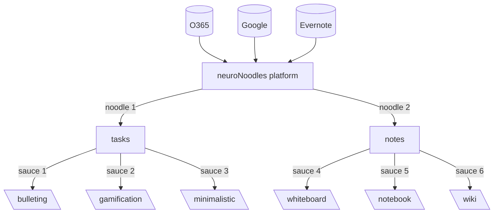

# neuroNoodles
An opensource platform, by and for neurodivergent people. 

## Join the community : 
[Join discord server](https://discord.com/invite/a34GqmEqWH) 

## The Idea
An opensource software platform that meets the needs of us neurodivergent people - because it comes from us. 

Of course, there are already lots of apps that focus on different aspects, but most of them are fee-based, limited to apple or android or cannot be combined with other tools. 
So, the idea is to create a platform that gives us the tools, like taskmanagement, calender, note taking and so on, we need in one place. Plus, adding different strategies for the tools to chose from. Because we all now, there will be not THE app, that will be our solution for the rest of our live. 

So why don't give us the ability to change the strategy without any hazzle? 

#### It's like pasta! We don't want to eat our spaghetti with the same sauce for the rest of our live. 

## The key points
* free and opensource
* barrier-free
* platform independent
* expandable through plugins
* selfhosting or cloud-based 
* community driven

## How far have we come so far? 
At the moment there is just the idea and i am looking for interested, neurodivergent people who wants contribute. 

## Whats next? 
The first milestone to achieve is to find enough contributors to create a more detailed concept for the launch of the entire project and community. 
